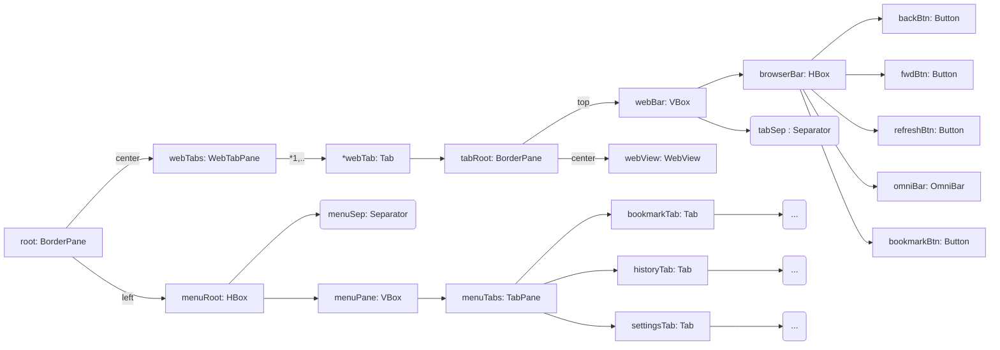

Software Dev. Plan
=================
_Andrew Osterhout (a02201315)_<br/>
_USU: Sp2020 -> CS2410: Event Driven Programing and GUI's_<br/>
_Final Project: basicFX-webBrowser_

## 1. Project Requirements:
### Assignment Requirements:
_Requirements that must be fulfilled for the assignment to get full credit for the course._

#### General Requirements:
JavaFX GUI Application that utilizes the following JavaFX features and Java Programming Methods:
 - At least 2 types JavaFX Panes organized well, to give your GUI a nice appearance and usability. (30 points)
 - At least 6 types of JavaFX Nodes, i.e. Buttons, TextField, Labels, CheckBoxes, RadioButtons, ImageView, etc. (30 points)
 - Animation i.e. Timeline or FadeTransition (15 points)
 - Events (20 points)
 - Bindings (20 points)
 - Listeners (20 points)
 - Server-Client, or Client-Client connectivity (15 points)

#### General Requirements for Web Browser Projects:
This project implements a Web Browser that allows the user to browse the internet.  The application should start up and automatically load the page: https://cs.usu.edu/ (Links to an external site.) .  It must implement the following requirements:
 - Have an address bar at the top of the GUI, a user can type an address, to load a website.
 - Successfully allow a user to browse around a website, redirecting correctly to all the links selected.
 - Add the functionality to store favorite links in a dropdown menu that users can add their favorite sites to.
 - When a user selects a site in the favorite links dropdown it should automatically load in the browser.
 - Add a “back” button that allows the user to go back to the previously visited website.  It only needs to go back one site (not store multiple sites).
 - _**Note:**_ This project does not need to add a chat feature, since the project itself already fulfills the Client-Server requirement.
 - You are allowed to use the WebView class `javafx.scene.web.WebView`.  
 - Have multiple tabs in the Web Browser that store multiple websites.
 - Add functionality to save the bookmarks to a file, so when I restart your GUI the bookmarks will reload in to the Web Browser Favorites dropdown menu.
 - When the user types a non-url into the address bar, automatically detect its not a url and perform a google search with that string


### My Personal Requirements:
_What things I am requiring myself to do for practice and personal standards reasons._

#### Asthenic Requirements:
 - Make it not look like default javafx basic os system styled UI
 - Make a custom window title bar.

#### Technical Requirements:
 - Use javaFXML in some capacity.
 - Use custom (& 3rd party) javafx css sheets for universal and coherent themes.
 - Using multiple classes for individualized tasks.
 - Extending javafx classes to make code more organized, and allow for easier implementation of multi-threading the tasks.
 - Using java packages to organize the code better.

### Desired Additional Features:
 - Application settings that allow theme changes without restarting the program.
 - Application settings that are remembered after the program closes.
 - Web History that can be remembered after the application closes.
 - Side menu system that can be over the web browser or offset the web browser when selected (this setting does not need to be persistent but could easily be made to be).

### Optional Additional Features:
 - An internet chat interface in the side menu.
   - either pier to pier or have one client be a host and a pier
     - less likely have a separate program be a simple server.
   - Use ip addresses to connect.
   - Save ip addresses as a contact with a name.
   - Allow for multiple chats to be going on at once (even more optional).
 - Making my own javafx css style sheets
   - otherwise will use some third party Open Source javafx css sheets (credit will be given in the [credit document](credit.md))
 - Allow for theme switching without restarting the application.
<br/><br/><br/>


## 2. System Requirements:
### Java Requirements:
#### Required:
 - Use JDK10 (outdated before this project began)
 - File access and manipulation in Java
 - JavaFX GUI System
   - `javafx.scene.Node` or any of their children
   - Any form of transition or animation form `javafx.animation.*`.
   - A Property Binding of some sort.
   - A Property Listener off some sort.
   - An Event Binding of some sort.
   - Any form of Client Server Network interaction.
#### Optional:
 - JavaFX FXML
   - FXML Scene Builder application
 - JavaFX CSS
  
<br/><br/><br/>


## 3. System Design:
### Functionality:
 - Save data to disk
   - I plan to use `.json` for easy and efficient reading and writing to disk.
   - Therefore I wiil need some JSON handling java Libraries:
     - `com.json.simple`: for basic JSON editing
     - `com.google.gson`: for more advanced object serialization and JSON editing

 - Back-end Managers:
   - settings manger
   - bookmark manager
   - history manager
 - For efficient access the use of a Global object would be effective.
   - All items in the `Global` object should be static
   - If the item/attribute/data-member does not manage access to it's own data it must be a constant/final

 - Gui Constriction and control methodologies:
   - the use of FXML to be able to have the Scene graph be easily designed in a more human readable way than the normal procedural methods of building a scene graph.
   - Divide the Gui's Scene graph into smaller more specialized components, this will better allow implementing some superficial data privacy and task encapsulation.
     - FXML scene Graph Breakdown will go as follows:
        ```mermaid
        %% You will need mermaid markdown rendering software to view this image
        graph TB
          main --> menu
              --> bookmark
              menu --> history
              menu --> settings
            main --> browser
              --> tab
        ```
   - Use FXML controller classes to collect the logic belonging to the nodes in each separate FXML file, as well as public access methods to be able to interact with the GUI from outside of it.
   - This methodology makes it so that setting properties can be set using `css` and assigning properties in the FXML files, this will save me from having to create subclasses of javafx nodes to customize components.


### Scene Graph:



## 4. System Testing:
  Get Portions running and test them as much as possible, before moving on the the next feature.


## 5. System Refinement:
Add additional features, such as using Google's favicon service to get icons for the tabs.


## 6. System Deployment:
1. Zip and submit to canvas
2. Tag Final Commit as `release1`.
3. Publish GitHub repo to public facing.


<!-- No mans land -->

<!-- ### UML:
```mermaid
classDiagram

    %%%%%%%%%%%%%%%%%%%%%%%%%%%%%%%%%%%%%%%%%%%%%%%%%%%%%
    %% - Class Declarations, Methods, and Attributes - %%
    %%%%%%%%%%%%%%%%%%%%%%%%%%%%%%%%%%%%%%%%%%%%%%%%%%%%%

    %% GUI Class Elements ---------------------------------
    class BasicFX_webBrowser {
        - loader : javafx::FXMLLoader
        - controller : FXMLController
        + main(String[] args)$ void
        + start(javafx::Stage mainStage)$ void
    }

    class FXMLController {

    }


        %% Derived javafx Classes --------------
        class WebTabPane {

        }

        class WebTab {

        }

        class OmniBar {

        }

        class MyWebView {

        }

        class ToolTabPane {

        }

        class ToolTab {

        }

        class BookmarkToolTab {

        }

        class HistoryToolTab {

        }

        class ChatToolTab {

        }

        class SettingsToolTab {

        }

    
    %% - Backend/Logic Classes: -------------------------


    %%%%%%%%%%%%%%%%%%%%%%%%%%%%%%%%%%%%%%%%%%%%%%%%%%%%%
    %% -             Class Relationships             - %%
    %%%%%%%%%%%%%%%%%%%%%%%%%%%%%%%%%%%%%%%%%%%%%%%%%%%%%

    %% - GUI Element Relationships -----------------------
      %% - Inheritance/Derivation Relationships ------------
      BasicFX_webBrowser --|> Application
      <<javafx>> Application

      WebTabPane --|> TabPane
      <<javafx>> TabPane

      WebTab --|> Tab
      <<javafx>> Tab

      OmniBar --|> TextField
      <<javafx>> TextField

      MyWebView --|> WebView
      <<javafx>> WebView

      ToolTabPane --|> TabPane

      ToolTab --|> Tab
      BookmarkToolTab --|> ToolTab
      HistoryToolTab --|> ToolTab
      ChatToolTab --|> ToolTab
      SettingsToolTab --|> ToolTab

      %% - Other Relationships ---------
      BasicFX_webBrowser --o "1" FXMLController

      FXMLController --o "1" WebTabPane
      FXMLController --o "1" ToolTabPane

      WebTabPane --* "1..n" WebTab

      WebTab --* "1" OmniBar
      WebTab --* "1" MyWebView

      ToolTabPane --* "1" BookmarkToolTab
      ToolTabPane --* "1" HistoryToolTab
      ToolTabPane --* "1" ChatToolTab
      ToolTabPane --* "1" SettingsToolTab 

```-->