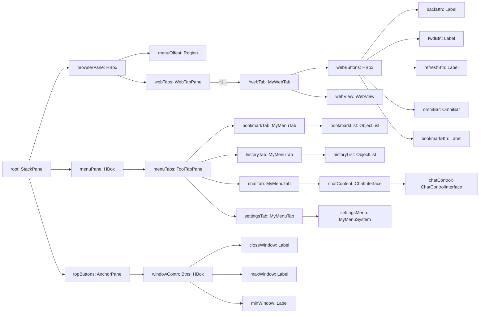
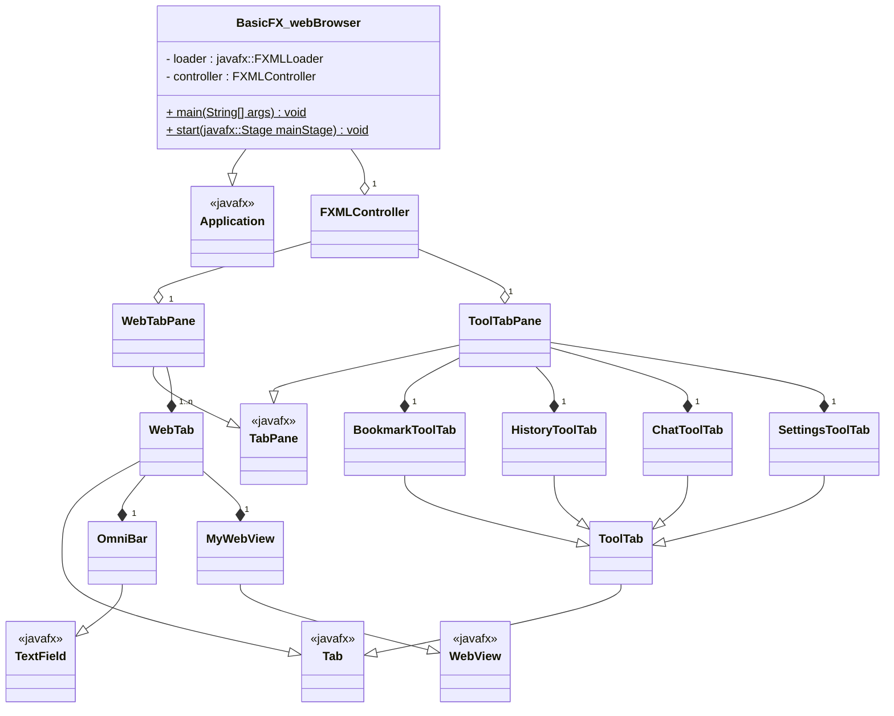

Software Dev. Plan
=================
_Andrew Osterhout (a02201315)_ 
_USU: Sp2020 -> CS2410: Event Driven Programing and GUI's_ 
_Final Project: basicFX-webBrowser_

## 1. Project Requirements:
### Assignment Requirements:
_Requirements that must be fulfilled for the assignment to get full credit for the course._

#### General Requirements:
JavaFX GUI Application that utilizes the following JavaFX features and Java Programming Methods:
 - At least 2 types JavaFX Panes organized well, to give your GUI a nice appearance and usability. (30 points)
 - At least 6 types of JavaFX Nodes, i.e. Buttons, TextField, Labels, CheckBoxes, RadioButtons, ImageView, etc. (30 points)
 - Animation i.e. Timeline or FadeTransition (15 points)
 - Events (20 points)
 - Bindings (20 points)
 - Listeners (20 points)
 - Server-Client, or Client-Client connectivity (15 points)

#### General Requirements for Web Browser Projects:
This project implements a Web Browser that allows the user to browse the internet.  The application should start up and automatically load the page: https://cs.usu.edu/ (Links to an external site.) .  It must implement the following requirements:
 - Have an address bar at the top of the GUI, a user can type an address, to load a website.
 - Successfully allow a user to browse around a website, redirecting correctly to all the links selected.
 - Add the functionality to store favorite links in a dropdown menu that users can add their favorite sites to.
 - When a user selects a site in the favorite links dropdown it should automatically load in the browser.
 - Add a “back” button that allows the user to go back to the previously visited website.  It only needs to go back one site (not store multiple sites).
 - _**Note:**_ This project does not need to add a chat feature, since the project itself already fulfills the Client-Server requirement.
 - You are allowed to use the WebView class `javafx.scene.web.WebView`.  
 - Have multiple tabs in the Web Browser that store multiple websites.
 - Add functionality to save the bookmarks to a file, so when I restart your GUI the bookmarks will reload in to the Web Browser Favorites dropdown menu.
 - When the user types a non-url into the address bar, automatically detect its not a url and perform a google search with that string

### My Personal Requirements:
_What things I am requiring myself to do for practice and personal standards reasons._

#### Asthenic Requirements:
 - Make it not look like default javafx basic os system styled UI
 - Make a custom window title bar.

#### Technical Requirements:
 - Use javaFXML in some capacity.
 - Use custom (& 3rd party) javafx css sheets for universal and coherent themes.
 - Using multiple classes for individualized tasks.
 - Extending javafx classes to make code more organized, and allow for easier implementation of multi-threading the tasks.
 - Using java packages to organize the code better.

### Desired Additional Features:
 - Application settings that allow theme changes without restarting the program.
 - Application settings that are remembered after the program closes.
 - Web History that can be remembered after the application closes.
 - Side menu system that can be over the web browser or offset the web browser when selected (this setting does not need to be persistent but could easily be made to be).

### Optional Additional Features:
 - An internet chat interface in the side menu.
   - either pier to pier or have one client be a host and a pier
     - less likely have a separate program be a simple server.
   - Use ip addresses to connect.
   - Save ip addresses as a contact with a name.
   - Allow for multiple chats to be going on at once (even more optional).
 - Making my own javafx css style sheets
   - otherwise will use some third party Open Source javafx css sheets (credit will be given in the [credit document](credit.md))
 - Allow for theme switching without restarting the application.
   

## 2. System Requirements:
### Research:
#### Java:
 - File access in Java

#### JavaFX (general):
 - 

#### FXML:
 - [Basic FXML tutorial (Jenkov)](http://tutorials.jenkov.com/javafx/fxml.html)
 - [Nesting FXML tutorial](https://riptutorial.com/javafx/example/7285/nested-controllers)
 - [Passing Data to FXML](https://riptutorial.com/javafx/example/8803/passing-data-to-fxml---accessing-existing-controller)

#### JavaFX CSS:
 - [Basic JavaFX CSS tutorial (Jenkov)](http://tutorials.jenkov.com/javafx/css-styling.html)
 - [BAsic CSS tutorial Series (Jenkov)](http://tutorials.jenkov.com/css/index.html)
 - ##### Third Party Themes:
   - temp

#### json:
  - `.json` in Java
    - temp

## 3. System Design:
### Scene Graph:

### UML:

## 4. System Testing:

## 5. System Refinement:

## 6. System Deployment:
1. Zip and submit to canvas
2. Tag Final Commit as `release1`.
3. Publish GitHub repo to public facing.